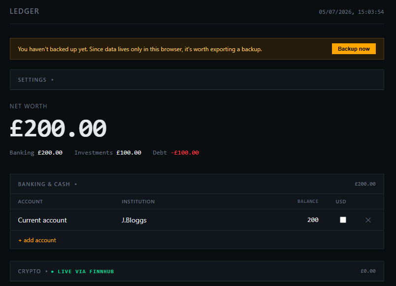

# Net Worth dashboard

A beautiful, single-file, self-hosted net worth dashboard with live prices. Built for privacy, simplicity, and daily use.



## Features

- **All-in-one view**: Banking & cash, Crypto, Stocks & Funds, Other investments, Debt & liabilities
- **Live prices**: Crypto (any symbol) and US-listed stocks via [Finnhub](https://finnhub.io) — refreshes every 60 seconds
- **Automatic GBP conversion**: USD holdings use live USD→GBP rate from [Frankfurter](https://frankfurter.dev)
- **Smart fallbacks**: Manual price entry for non-supported tickers (e.g. UK .L, Canadian .TO)
- **Visuals**: Allocation donut chart + 180-day net worth trend
- **Privacy-first**: Everything stored in browser `localStorage`. No accounts, no backend, no telemetry.
- **Secure backup**: Encrypted export/import (AES-GCM) with optional PIN lock
- **Zero build step**: One HTML file with inline CSS + vanilla JS

## Screenshots

[Net Worth Dashboard Overview](screenshot-1.PNG)

[Allocation and History Charts](screenshot-2.PNG)

## Quick Start

1. Download [`index.html`](index.html)
2. Open it in any modern browser
3. (Optional but recommended) Get a free [Finnhub API key](https://finnhub.io/register) and paste it in **Settings**
4. Start adding your accounts and holdings

**Pro tip**: Host it properly (see below) for best experience across devices.

## Hosting

### Easiest options (recommended)
- **GitHub Pages** — Perfect for pointing at your own domain
- Cloudflare Pages, Netlify, Vercel, or any static host

### Self-hosted (homelab style)
```bash
## Caddy (one-liner)
caddy file-server --root /path/to/net-worth-ledger --listen :8080
```
Since it's a single static file, it works great behind authentication (Authelia, OAuth2 Proxy, etc.) if you want extra protection.

## Data & Privacy

All data lives only in your browser.
- Your Finnhub key is stored in localStorage (never leaves your device except for price API calls).
- Encrypted backups include the API key so you can restore everything easily.
- No sync by design — keeps the project zero-dependency. Export/import is the intended way to move data.

See docs/privacy.md for more details.

## Limitations

- Finnhub free tier: 60 calls/minute and US-listed stocks only
- No multi-device live sync (use encrypted backup or add your own backend)
- Debt interest is a simple estimate

## Contributing
Contributions welcome! This is intentionally kept as a single file for simplicity, but improvements to UX, charts, or new asset types are appreciated.

## License
MIT License — feel free to fork and modify.

Made for personal use with zero waste and maximum sovereignty.
